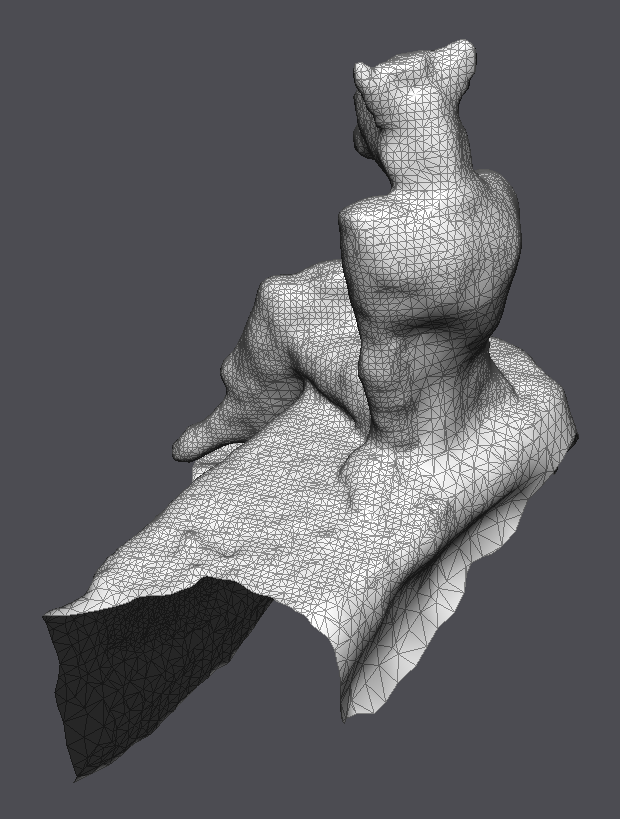

== Exercise 12 - Processing of Scanned Model

|===
|image:images/real_world.jpg[Photo model]|image:images/3d_model.png[Scanned Object]
|image:images/wireframe_front.png[ ]|
|===

* vertices: 10734
* faces: 25649
* edges: 38569

=== Curvature Estimation

==== Mean curvature

|===
|Uniform Weights |
|image:images/curvature/laplace_beltrami_front.png[ ] | image:images/curvature/laplace_beltrami_back.png[ ]
|Cotangent Weights |
|image:images/curvature/uniform_laplacian_front.png[ ] | image:images/curvature/uniform_laplacian_back.png[ ]
|===

=== Smoothing

=== Feature Enhancement

=== Remeshing

* target length = 2
* target length = 0.25

=== Parameterization

=== Deformation
