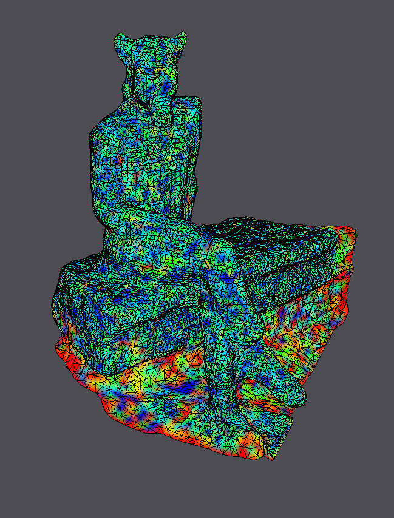

== Exercise 12 - Processing of Scanned Model
:stem: latexmath

|===
|image:images/real_world.jpg[Photo model]|image:images/3d_model.png[Scanned Object]
|image:images/wireframe_front.png[ ]|image:images/wireframe_back.png[ ]
|===

* vertices: 12919
* faces: 25648
* edges: 38569
* Euler formula: latexmath:[V - E + F = -1] (but has a boundary)

=== Curvature Estimation

==== Curvature

|===
|Mean Curvature with Uniform Weights |
| | image:images/curvature/uniform_laplacian_back.png[ ]
|Mean Curvature with Cotangent Weights |
|image:images/curvature/laplace_beltrami_front.png[ ] | image:images/curvature/laplace_beltrami_back.png[ ]
|Gaussian curvature |
|image:images/curvature/gaussian_front.png[ ] | image:images/curvature/gaussian_back.png[ ]
|===

=== Smoothing

|===
|Implicit Smoothing |
|image:images/smoothing/implicit.png[ ] | 
|Explicit Smoothing |
| | 
|Mean Curvature after Explicit Smoothing |
|image:images/smoothing/uniform_explicit_curv.png[ ] | image:images/smoothing/uniform_explicit_curv_back.png[ ]
|===

=== Feature Enhancement

=== Remeshing

|===
|image:images/remeshing/[target_length_0.25_average_front.png] |image:images/remeshing/target_length_0.25_average_back.png[]
|image:images/remeshing/[target_length_0.25_curvature_front.png] |image:images/remeshing/target_length_0.25_curvature_back.png[]
|===

* target length = 2
* target length = 0.25

=== Parameterization

=== Deformation
