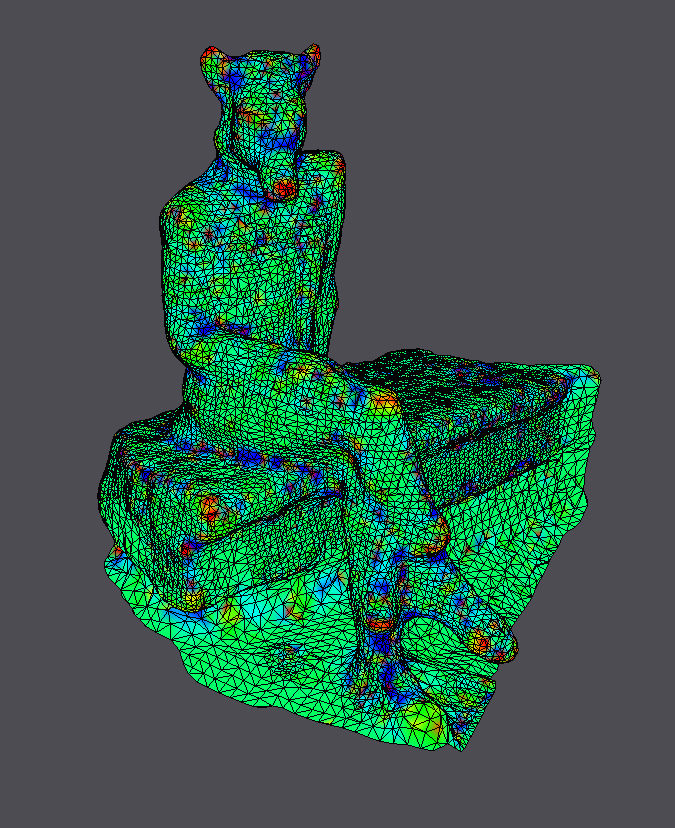
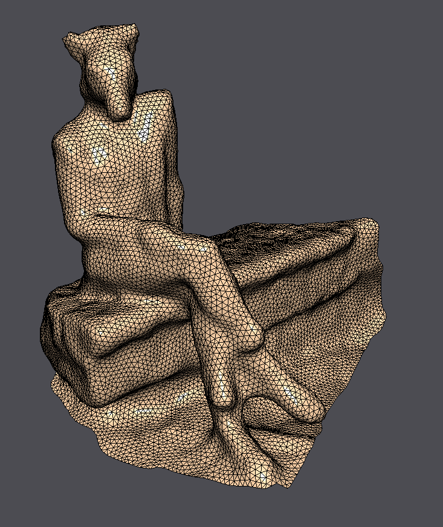

== Exercise 12 - Processing of Scanned Model
:stem: latexmath

=== TODO

* describe advantages and disadvantages of each specific method
* illustrate issues and artifacts on our own data
    * cotan!
    * provide explanations for these issues
    * formulate own thoughts on how the problems could potentially be alleviated

|===
|image:images/real_world.jpg[Photo model]|image:images/3d_model.png[Scanned Object]
|image:images/wireframe_front.png[ ]|image:images/wireframe_back.png[ ]
|===

* vertices: 12919
* faces: 25648
* edges: 38569
* Euler formula: latexmath:[V - E + F = -1] (but has a boundary)

=== Curvature Estimation

==== Curvature

|===
|Mean Curvature with Uniform Weights |
|image:images/curvature/uniform_laplacian_front.png[ ] | image:images/curvature/uniform_laplacian_back.png[ ]
|Mean Curvature with Cotangent Weights |
|image:images/curvature/laplace_beltrami_front.png[ ] | image:images/curvature/laplace_beltrami_back.png[ ]
|Gaussian curvature |
| | image:images/curvature/gaussian_back.png[ ]
|===

=== Smoothing

|===
|Implicit Smoothing |
| | image:images/smoothing/implicit_back.png[]
|Explicit Smoothing |
|image:images/smoothing/uniform_explicit.png[ ] | image:images/smoothing/uniform_explicit_back.png[ ]
|Mean Curvature after Explicit Smoothing |
|image:images/smoothing/uniform_explicit_curv.png[ ] | image:images/smoothing/uniform_explicit_curv_back.png[ ]
|===

=== Feature Enhancement

=== Remeshing

|===
|Uniform remeshing for target length = 0.25 |
| | image:images/remeshing/target_length_0.25_average_back.png[]
|Adaptive remeshing for target length = 0.25 |
| | image:images/remeshing/target_length_0.25_curvature_back.png[]
|Uniform remeshing for target length = 0.75 |
| |
|Adaptive remeshing for target length = 0.75 |
|image:images/remeshing/target_0.75_curvature.png[] |
|Uniform remeshing for target length = 1 |
| |
|Adaptive remeshing for target length = 1 |
|image:images/remeshing/target_1_curvature.png[] |
|===

Obviously, the uniform remeshing works only for smaller target lengths because for larger target lengths (and thus less triangles) the specific geometry cannot reproduced.
Hence, it is hard to fit to parts with a higher curvature.
This can be best seen in the uniform remeshing for target lengths and 0.75 and 1.
However, with uniform remeshing there are some problems with ceratin parts like the earseven for a target length of 0.25.

The adaptive remeshing even works for a target length of 1. Although not every geometric information is perfectly preserved, the shape stays highly comprhensible.

=== Parameterization

|===
|Parameterization
| | 
|Parameterization after 25 iterations
|image:images/parameterization/iterative_25_iterations.png[] |
|Minimal surface
| |
|===

=== Deformation

|===
|Minimal surface deformation
|image:images/deformation/deformation_fat_bear_minimal_surface.png[] |
|Thin-plate deformation
|image:images/deformation/deformation_fat_bear_thin_plate.png[] |
|===
