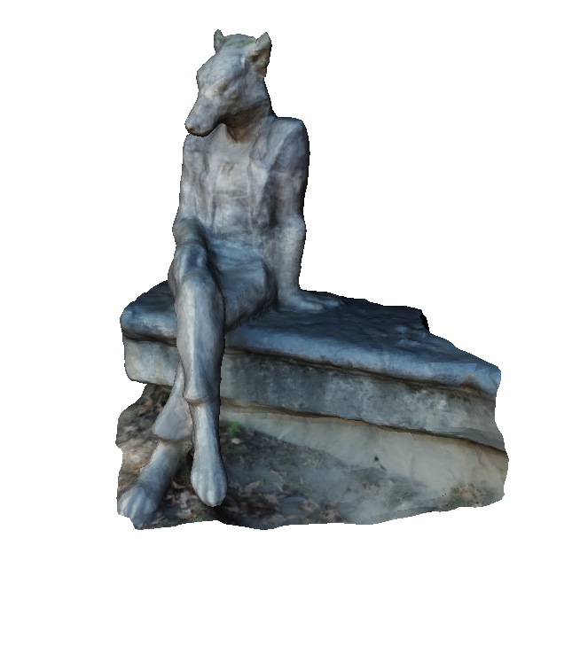
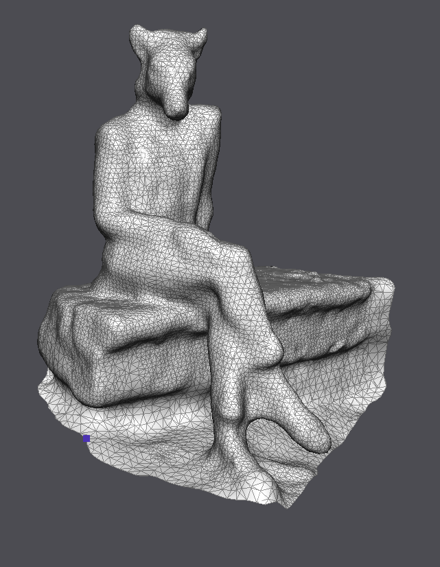
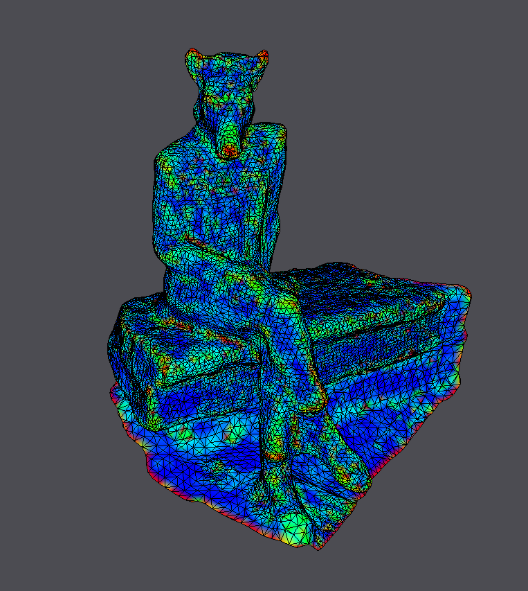
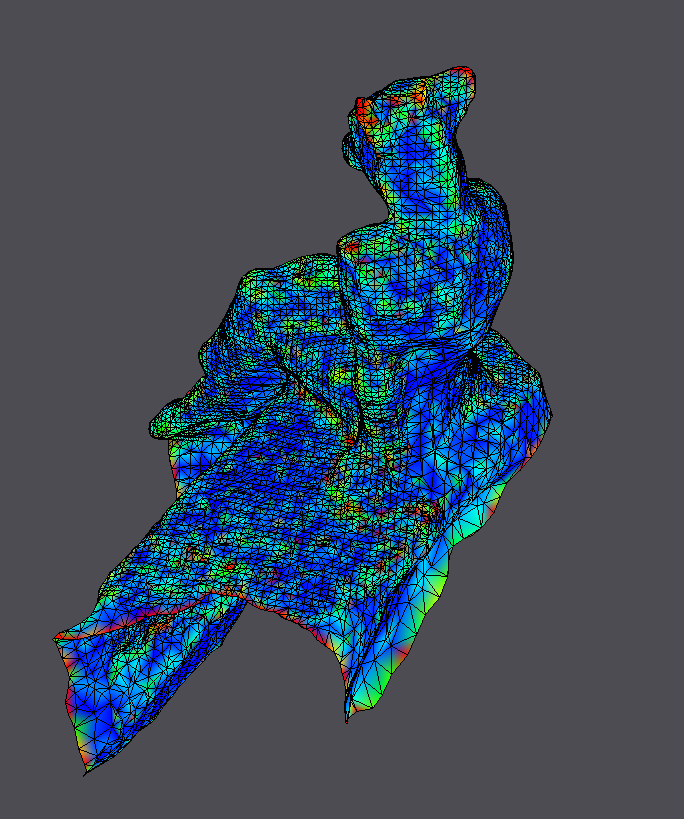
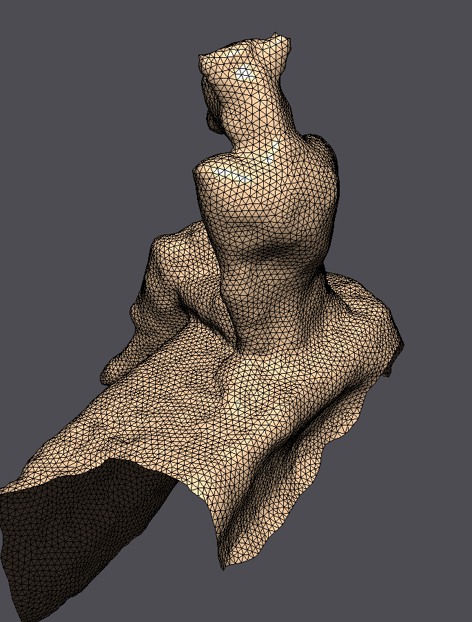
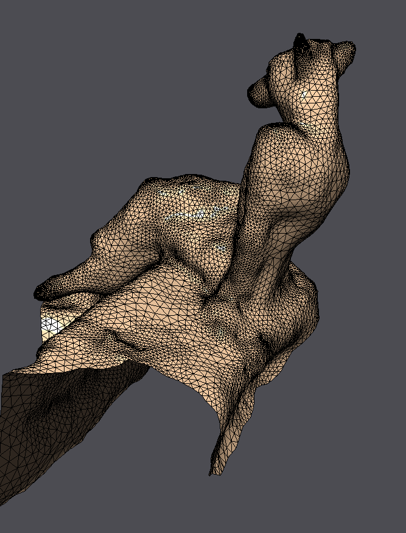

= Exercise 12 - Processing of Scanned Model
Group 7 - Jannik Reichert, Niklas Schmitz, Arne Sachtler
:stem: latexmath

== Our Model

We scanned the fox statue in front of the banana-shaped building on the UNIL campus.
Below you can see a photo of the model, a textured 3D model rendered in one pose and two poses of the resulting mesh in the DGP viewer.

|===
|image:images/real_world.jpg[Photo model]|
||image:images/wireframe_back.png[ ]
|===

Our mesh has the following properties:

* vertices: 12919
* faces: 25648
* edges: 38569
* it has a single boundary
* it has not disk-like topology as we have genus 1.

You can find the wavefront model of our model link:./model[here].

== Curvature Estimation

Below we show the discrete curvature estimations of mean- and Gaussian curvature. For the mean curvature we show the results of uniform- and cotan-weighted Laplace-Beltrami, respectively.
We can observe some artifacts, where the cotangent-weighted mean curvature is large on the flat region. The mesh seems to have some angle configurations, which make the cotangent weights unstable.

|===
2+|Mean Curvature with Uniform Weights
|image:images/curvature/uniform_laplacian_front.png[ ] | image:images/curvature/uniform_laplacian_back.png[ ]
2+|Mean Curvature with Cotangent Weights
| | 
2+|Gaussian curvature
|image:images/curvature/gaussian_front.png[ ] | image:images/curvature/gaussian_back.png[ ]
|===

== Smoothing

We first tried implicit smoothing on our mesh with a large diffusion constant latexmath:[\lambda = 10^4] and show the result in the first row.
As shown in the curvatures estimates section above, our mesh has some artifacts when using cotangent weights.
Therefore, the results of explicit smoothing with cotan weights shows some artifacts, while the uniformly weighted one looks good.
For the trials, we used a diffusion constant of latexmath:[\lambda = 0.5] and latexmath:[25] iterations.
Additionally, we show the mean curvature of the resulting model after the explicit smoothing.

|===
2+|Implicit Smoothing
|image:images/smoothing/implicit.png[ ] | image:images/smoothing/implicit_back.png[]
2+|Explicit Smoothing Using Uniform Weights
|image:images/smoothing/uniform_explicit.png[ ] | image:images/smoothing/uniform_explicit_back.png[ ]
2+|Explicit Smoothing Using Cotan Weights
| | 
2+|Mean Curvature after Explicit Smoothing with Uniform Weights
| | 
|===

In order to overcome the anomalies with the cotan weights, remeshing would be one approach. The idea is, that remeshing changes also the angles in the mesh and will lead to no strangely behaving angles and will consequently improve the cotan weights.

== Feature Enhancement

Feature enhancement on our model is quite challenging, as we have also some scraggly surfaces on the bench and the floor. These will always show up, when we try to, for instance, enhance the ear or nose feature. Below you can see the issues with enhancing the surface roughness. Note also, that the increase in ear and nose size is evident.

|===
| | 
|===

== Remeshing

We try the remeshing algorithm for different target lengths using both, non-adaptive and adaptive remeshing. In adaptive remeshing, the target length is scaled by the inverse of the curvature.
The remeshing on our mesh works quite well and also for larger target lengths, the curvature-adaptive remeshing can provide nice results.

|===
2+|Uniform remeshing for target length = 0.25
|image:images/remeshing/target_length_0.25_average_front.png[] | 
2+|Adaptive remeshing for target length = 0.25
|image:images/remeshing/target_length_0.25_curvature_front.png[] | 
|Uniform remeshing for target length = 0.75
|Adaptive remeshing for target length = 0.75
|image:images/remeshing/target_0.75_average.png[]
|
|Uniform remeshing for target length = 1
|Adaptive remeshing for target length = 1
|image:images/remeshing/target_1_average.png[]
|
|===

Obviously, the uniform remeshing works only for smaller target lengths because for larger target lengths (and thus less triangles) the specific geometry cannot reproduced.
Hence, it is hard to fit to parts with a higher curvature.
This can be best seen in the uniform remeshing for target lengths and 0.75 and 1.
However, with uniform remeshing there are some problems with ceratin parts like the earseven for a target length of 0.25.

The adaptive remeshing even works for a target length of 1. Although not every geometric information is perfectly preserved, the shape stays highly comprhensible.

== Parameterization

Below we show the results of the texture mapping and parametrization for out model. Additionally, we show the minimal surface of interpolated between the boundary using our mesh topology. As the surface is genus 1 and the minimal surface doesn't change the surface's genus, we also get a genus 1 minimal surface.

Our model a quite a large boundary, but the connection between the bench and the fox is quite narrow and as the mapping is convex, the complete fox will be mapped to a small region in paramter space.
Therefore, the texture looks quite good for the bench, but the quality is poor for the fox.
Our model has no disk topology and we therefore expect edge intersections in the paramter domain.

|===
2+|Parameterization (Direct Solution)
|image:images/parameterization/front.png[] | image:images/parameterization/back.png[ ]
|Parameterization (iterative) after 25 iterations
|Minimal surface
|
|image:images/parameterization/minimal_surface.png[]
|===

== Deformation

Using our model one can really clearly see the locality of the deformation using latexmath:[\Delta] and the globality of using latexmath:[\Delta^2]. For the results below, we fixed the same face and shifted the same face by the same vector, but using the minimal surface once and the thin-plate approach, respectively.
We stretched the bench in length. For the minimal surface we observe that basically only the surface is deformed and the bench and the fox are only shifted in space. On the other hand, the thin-plate approach for deformation stretches the model as a whole.

|===
|Minimal surface deformation|Thin-plate deformation
| | 
|===
