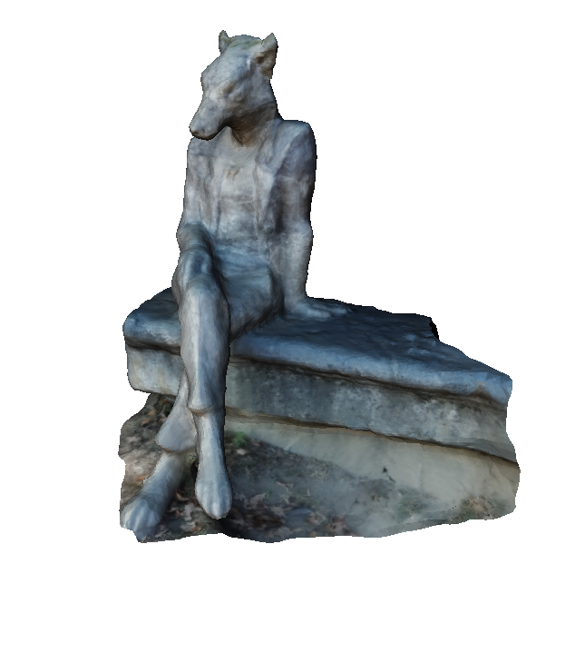
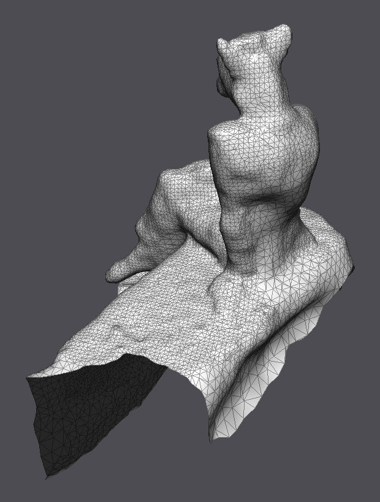
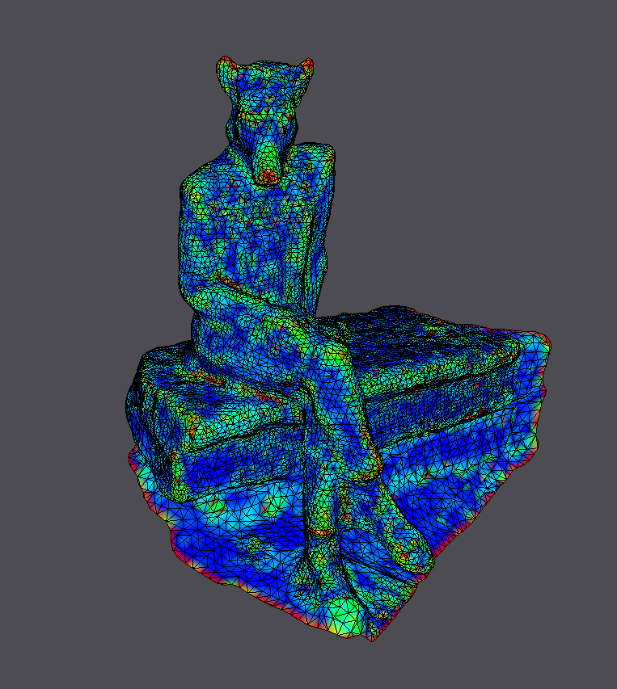
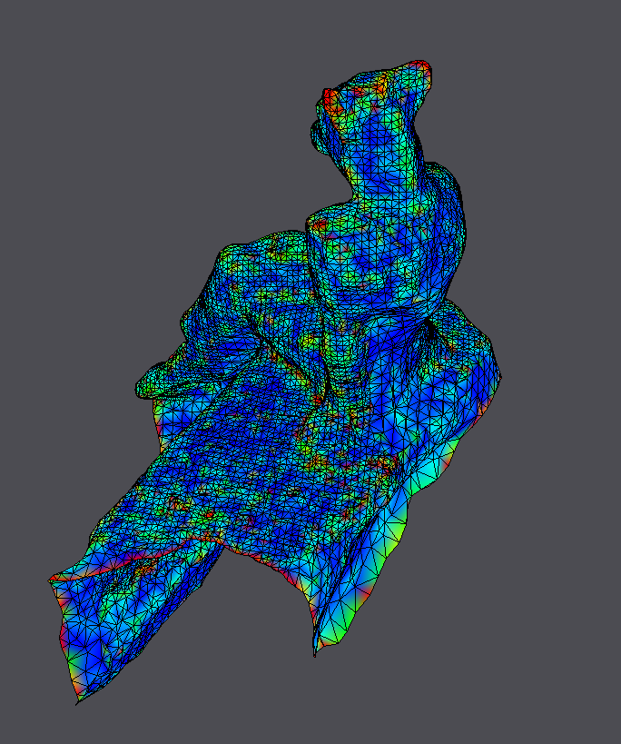
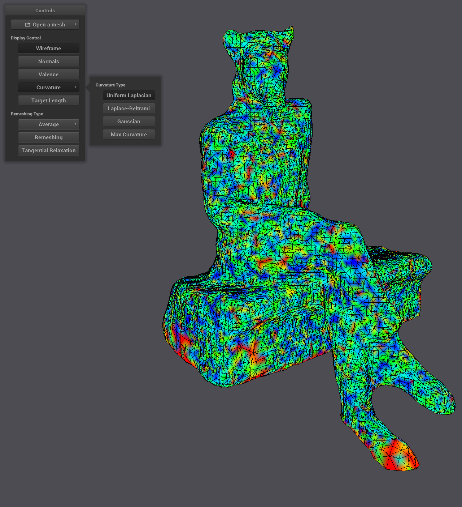
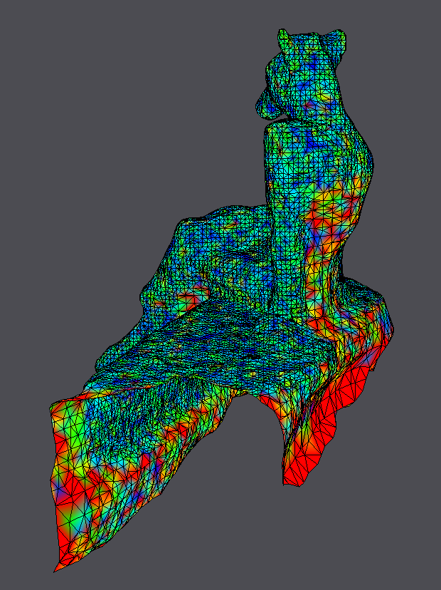

# Exercise 12 - Processing of Scanned Model

|||
|-|-|
|{ width=50% } |
||

vertices: 10734
faces: 25649
edges: 38569

## Curvature Estimation

### Mean curvature
|||
-|-
Uniform Weights |
 | 
 Cotangent Weights |
 | 

## Smoothing

## Feature Enhancement

## Remeshing

target length = 2

target length = 0.25

## Parameterization

## Deformation
